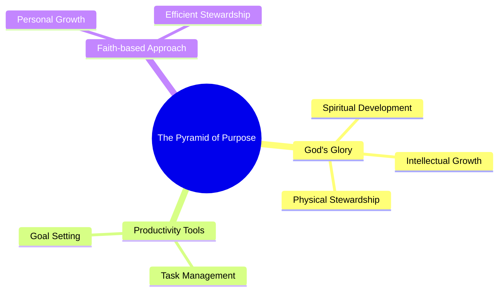

# The Self-Help Lie Deceiving Christians
## Content

> [!summary]- Description
> ["Personal productivity from a Christian worldview for the glory of God.\n\n► Get the weekly ⁠⁠⁠newsletter⁠⁠⁠ https://redeemingproductivity.com/new...\n► Join the ⁠⁠⁠⁠Redeeming Productivity Academy⁠ https://redeemingproductivity.com/aca...\n► Use the Notion Planner https://christianproductivity.comPersonal productivity from a Christian worldview for the glory of God.\n\n► Get the weekly ⁠⁠⁠newsletter⁠⁠⁠ https://redeemingproductivity.com/new... …\n              \n\nHow this was madeAuto-dubbedAudio tracks for some languages were automatically generated. Learn more\n\n  Transcript\n\n\n  Follow along using the transcript.\n\n\n  Show transcript\n\n\n\n  \n  \n    Redeeming Productivity\n    \n      33.2K subscribers\n    \n  \n\n\n  Videos\n  About\n\n\n  \n    \n       \n    \n  \n  \n    VideosAbout\n  \n  \n    \n       \n    \n  \n\n\n\n\n              \n\n\n            "," …"]

# AI Analysis

## 🧩 General Summary
This video challenges the traditional secular self-help narrative by arguing that true productivity and life purpose are found through a Christian worldview focusing on glorifying God. Reagan Rose presents a framework called the "pyramid of purpose," emphasizing that all areas of personal development—spiritual, intellectual, and physical—should ultimately serve a higher mission: honoring God's glory. He underlines the importance of using productivity tools not as ends in themselves but as means to achieve faithful stewardship, integrating personal improvement with divine purpose.

## 🧭 Directed Applications
- **Engineering & Systems Thinking**: Implement systems that prioritize long-term goals aligned with core values and divine purpose, ensuring projects support these overarching aims.
- **Creativity & Storytelling**: Develop narratives and content that reflect purpose-driven growth, drawing on personal faith and experiences as storytelling tools.
- **Faith & Character Formation**: Approach personal growth with the aim of enhancing your ability to contribute to faith communities and society.
- **ADHD/ASD Strategies**: Structure tasks around personal rhythms, using habitual anchors to support executive function and aligning with meaningful objectives.
- **Multipassionate Integration**: Identify common threads among diverse interests to form a cohesive purpose, using faith as a unifying principle.

## 🗺️ Concept Map

## 💬 Notable Quotes
- “Time and again, I found that there is one big lie behind every message of worldly self-help, and it's this: you belong to you.” [0:38](https://www.youtube.com/watch?v=<video_id>&t=38s)
- “We're employing the methods of personal productivity in service of greater faithfulness to God in each of these areas.” [5:54](https://www.youtube.com/watch?v=<video_id>&t=354s)

## 🔁 Reflection Prompts
- How can you integrate systems thinking into your spiritual growth and daily productivity?
- What creative projects can you undertake that align with both your passions and your faith?
- In what ways can neurodivergent perspectives enhance your approach to personal development and faith?
- How can you ensure that your diverse interests serve a unified, purpose-driven life mission?

## Personal Notes
- [x] Process note  [completion:: 2025-11-29]
## Transcript
> [!note]- Transcript (Youtube)
> 0:00 The world is full of self-help gurus
> 0:03 claiming to have the secret to a happier
> 0:05 life. They say that if we just listen to
> 0:07 them, we can be more successful, more
> 0:10 attractive, make more money, and in all
> 0:12 just be more satisfied with our lives.
> 0:16 But
> 0:18 they are lying to you. Okay, was that a
> 0:21 little dramatic? Was the red light a
> 0:22 little much? Hey, if you are new here,
> 0:24 my name is Reagan Rose. I am the creator
> 0:27 of Redeeming Productivity, which is a
> 0:29 ministry designed to help Christians get
> 0:31 more done for the glory of God. But I
> 0:34 have a little bit of a confession, and
> 0:35 that's that I love self-help books. But
> 0:38 time and again, I found that there is
> 0:40 one big lie behind every message of
> 0:43 worldly self-help, and it's this: you
> 0:47 belong to you. And I want to show how
> 0:50 even Christians can fall for this lie
> 0:52 sometimes and why it is absolutely
> 0:54 critical that we build our concept of
> 0:57 self-help or even personal productivity
> 1:00 on the word of God and not on worldly
> 1:02 wisdom.
> 1:04 One of the things you begin to notice
> 1:06 about self-development and self-help
> 1:09 books the more you read them is that
> 1:11 self-help is inherently religious.
> 1:15 \[Music\]
> 1:17 When you start thinking about self-help,
> 1:20 you have to ask the bigger questions of
> 1:22 life. Why am I here? What's the purpose
> 1:25 of life? And these are all ultimately
> 1:28 religious questions. They speak to our
> 1:30 purpose and what it is we're supposed to
> 1:32 be pursuing.
> 1:34 Look at all those nice eggs.
> 1:37 Good job, girls.
> 1:39 It doesn't take long to notice the
> 1:41 religious overtones in even the most
> 1:43 popular self-development books. This is
> 1:46 why in atomic habits, James Clear can
> 1:49 talk about how our habits are downstream
> 1:52 from our identity. You have Mark Manson
> 1:56 talking about beliefs in a very
> 1:58 utilitarian way and saying, "Change out
> 2:00 your beliefs that aren't helping you get
> 2:02 the life you want for beliefs that will
> 2:04 help you get the life you want." As if
> 2:06 it didn't matter whether the belief was
> 2:07 true or not, just whether it helps you
> 2:09 to get what you want out of life. You
> 2:11 cannot talk about the big questions of
> 2:14 life or even what it means to improve
> 2:17 without having some defined idea about
> 2:20 why I'm here and what I'm supposed to be
> 2:22 doing. Self-help will always get
> 2:23 religious. It can't help itself.
> 2:27 But what is the good life then? That's
> 2:29 the big question. Because behind every
> 2:32 definition of self-help, there's always
> 2:34 this assumption about what constitutes
> 2:38 the good life. What is the purpose of
> 2:40 life? Now, whether stated explicitly or
> 2:44 not, it's always going to be assumed
> 2:46 that the purpose of life is my
> 2:49 happiness. One of the great advantages
> 2:52 Christians have is that we literally
> 2:54 know why we exist. We know the meaning
> 2:57 of life. God has told us in his word
> 2:59 that it's not all about me. In fact,
> 3:02 it's all about him.
> 3:06 We know that the happy life, the blessed
> 3:08 life is the one that has us walking with
> 3:10 the Lord daily, saved by grace through
> 3:13 faith in Jesus Christ, planted like a
> 3:17 tree by streams of water and stewarding
> 3:20 every day of this life for his sake. But
> 3:22 the sad thing, the the tragic thing and
> 3:25 the reason I'm making this is that even
> 3:27 mature believers can fall back into this
> 3:30 way of thinking and assuming it's my
> 3:32 life and that's where I'm going to find
> 3:34 my fulfillment.
> 3:37 So what would a Christian vision of
> 3:39 self-help look like then? Because one
> 3:41 thing that the self-help gurus do get
> 3:43 right is that we should be growing. We
> 3:46 should be seeking to develop ourselves.
> 3:48 It still baffles me that there are so
> 3:50 many Christians who are just content to
> 3:52 stagnate. They don't care about their
> 3:55 spiritual growth. They don't care about
> 3:56 getting in the word. They don't care
> 3:58 about growing themselves, making them a
> 4:01 better tool in the hand of God. It
> 4:04 reminds me a lot of the wicked servant
> 4:07 in the parable of the talents who took
> 4:09 the things that God had entrusted to him
> 4:11 and he just buried them in the ground.
> 4:13 So, let's assume that we want to be good
> 4:15 stewards of these lives, but we want to
> 4:17 do it in the right way. What would that
> 4:20 look like? So, let me show you a
> 4:21 framework that can help us think about
> 4:23 self-development from a more godly
> 4:25 perspective.
> 4:28 This is the pyramid of purpose.
> 4:33 So, we look at this, we're asking the
> 4:34 question, what are we building toward in
> 4:37 our life? And at the top of the pyramid,
> 4:40 the answer to that is God's glory.
> 4:45 God's glory is the chief end of man.
> 4:47 Everything we do should support this
> 4:49 ultimate mission. And so if we work
> 4:51 backwards from that, how would we lead a
> 4:53 God-glorifying life? Well, we might
> 4:55 think about the different domains.
> 4:59 These are the different areas of your
> 5:00 life that God has given you to steward.
> 5:03 One way we talk about this in the
> 5:05 academy is we talk about your spiritual,
> 5:07 intellectual, physical, recreational,
> 5:09 relational, vocational, and economical
> 5:11 domains. That sounds like a lot, but
> 5:13 it's just a way of breaking your life
> 5:15 down into categories so you can ask the
> 5:17 question, am I being a faithful steward
> 5:19 in each of these areas? So once you have
> 5:21 these domains of stewardship articulated
> 5:24 and what faithfulness looks like in each
> 5:26 of them, then we can employ goals.
> 5:31 Goals are simply a way for us to say,
> 5:33 "Hey, I want to improve in this single
> 5:36 area of life. Let me make a plan for how
> 5:38 I'm going to improve my faithfulness in
> 5:40 that area." This would be like an
> 5:42 exercise goal to improve the physical
> 5:44 domain of stewardship. This would be a
> 5:46 spiritual goal like reading through the
> 5:48 New Testament, right? You get the idea.
> 5:51 We're employing the methods of personal
> 5:52 productivity in service of greater
> 5:54 faithfulness to God in each of these
> 5:56 areas, in service of our ultimate
> 5:58 mission to glorify God in all areas of
> 6:00 life. And then we break these goals down
> 6:02 into projects. These are just bundles of
> 6:06 tasks that help us reach the goal. It's
> 6:09 us breaking that goal down into here's
> 6:11 the milestones. Here's the things I'm
> 6:13 going to do. Here's what I'm going to
> 6:14 track to help get me there. And at the
> 6:16 very bottom is just our day-to-day. It's
> 6:18 the tasks I must do. It's the habits
> 6:22 that I'm practicing. These are just the
> 6:25 little things in life like finishing the
> 6:27 paper for school or sending an email or
> 6:30 reading your Bible daily or going to the
> 6:32 gym or whatever those things are. And
> 6:35 the purpose of the pyramid of purpose is
> 6:38 to be able to holistically look at our
> 6:39 life and strategically say, how do all
> 6:43 of these fit together towards my
> 6:45 ultimate objective? Because if you
> 6:47 approach your life this way and you're
> 6:49 strategically setting goals and you're
> 6:51 breaking them into projects and you're
> 6:52 doing tasks and habits that contribute
> 6:54 to that, you should be able to draw an
> 6:56 arrow from any level of your life
> 7:02 such that you can see clearly how all of
> 7:04 this contributes to your ultimate
> 7:06 purpose of glorifying God with your
> 7:08 life. Thomas Watson said that the glory
> 7:11 of God must be a silver thread which
> 7:13 runs through all that we do. And that's
> 7:16 exactly what we're trying to do when we
> 7:17 use this framework of the pyramid of
> 7:19 purpose. It's about self-development,
> 7:21 but it's self-development for a purpose,
> 7:24 the ultimate purpose, God's glory. When
> 7:27 we understand personal productivity and
> 7:29 self-help as just tools that can help us
> 7:33 rather than a philosophy of life or a
> 7:36 religion, then we can put them in their
> 7:39 proper place and let them actually aid
> 7:42 us in pursuing a better, more faithful
> 7:45 stewardship of our life. But this
> 7:47 requires some discernment. So, I can
> 7:50 appreciate that there's a skill to
> 7:52 learning how to set and reach goals. And
> 7:54 I can learn that from even some of these
> 7:56 books. But I have to view it through the
> 7:59 ultimate lens that the goal of all goals
> 8:02 is the glory of God. I can still
> 8:05 schedule my week and do my weekly
> 8:08 reviews, but I do it with an
> 8:09 understanding that what I'm actually
> 8:11 doing is stewarding God's time. It's not
> 8:14 my life. And even as I pursue better
> 8:17 habits, I'm doing it with an
> 8:19 understanding that it is Christ working
> 8:22 in me both to will and to work for his
> 8:24 good pleasure. It's all downstream from
> 8:26 knowing that I belong to him. I don't
> 8:29 belong to me. Self-help and personal
> 8:31 productivity make great tools, but
> 8:34 terrible religions. So, if you're a
> 8:36 Christian who takes seriously God's call
> 8:38 for you to steward your life for his
> 8:41 glory, I would invite you to subscribe
> 8:43 to the channel and follow along as I
> 8:46 seek to help you redeem productivity. ---
